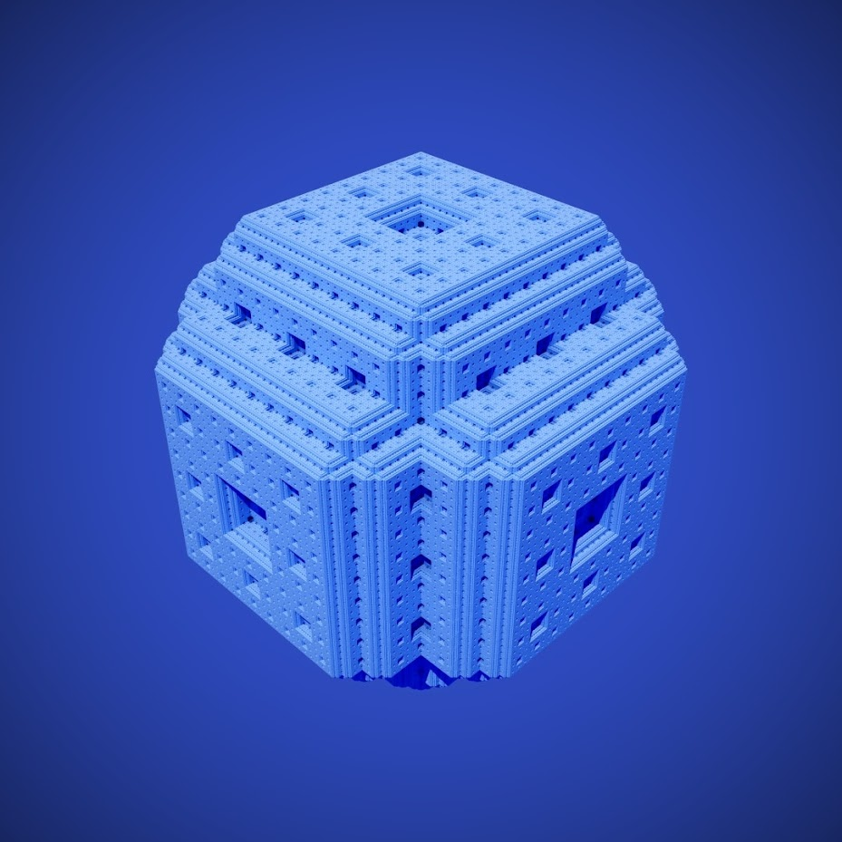
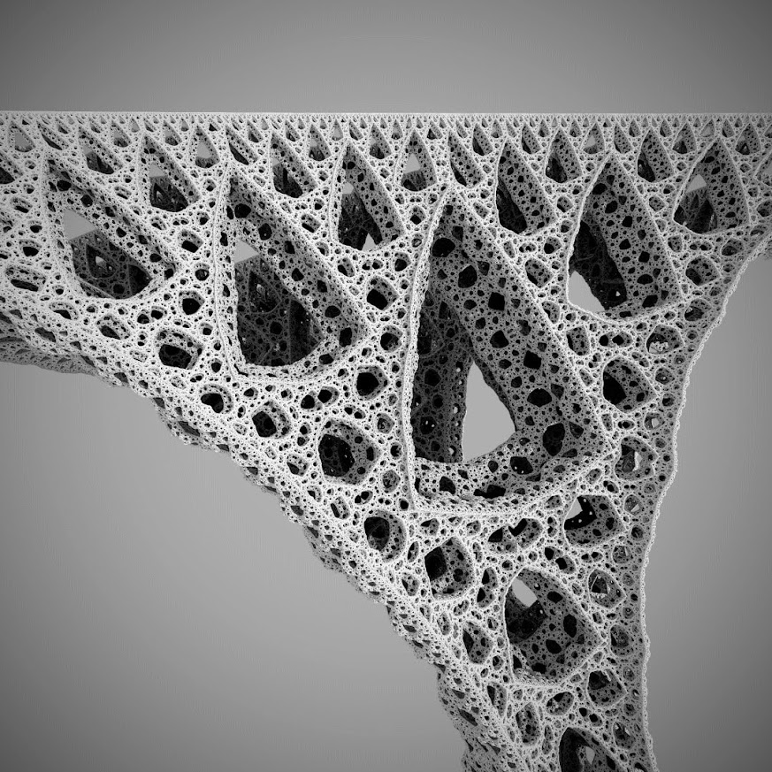
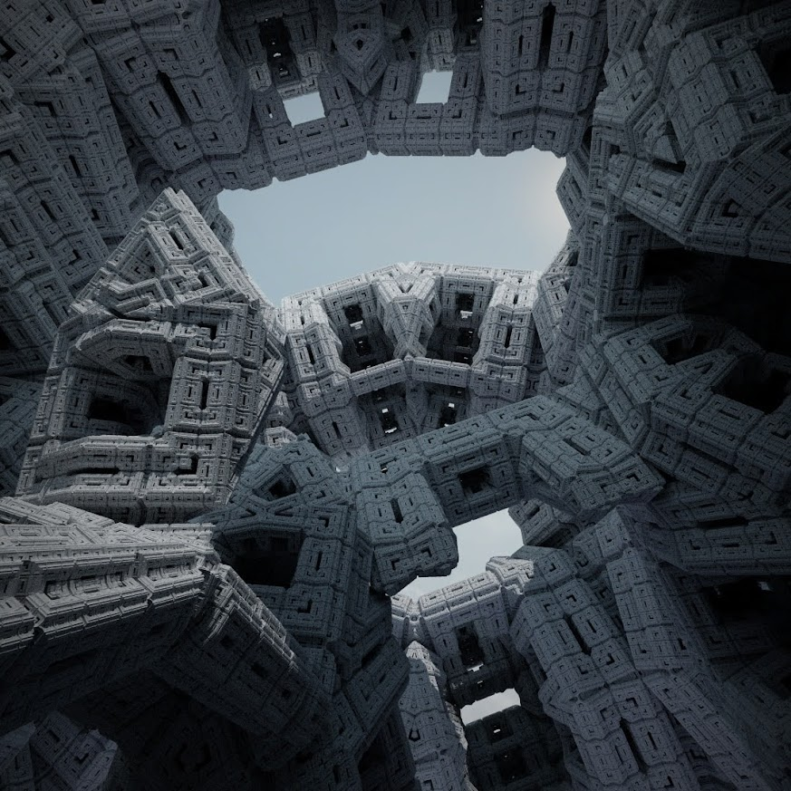
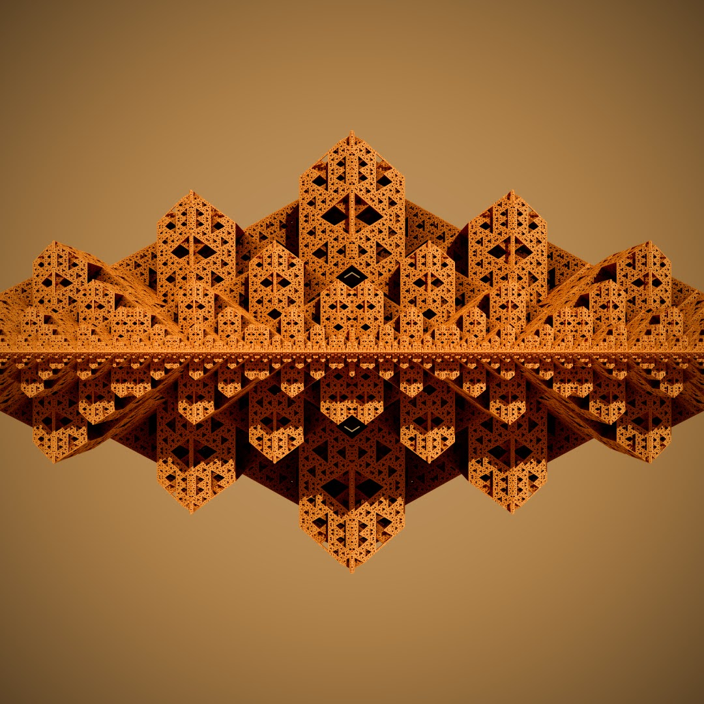

# Fractos
### JavaScript 3D fractal renderer

- Create highly customizable 3D fractals
- Specialized ray marcher allows the fractals to be rendered in real time
- Use the built-in path tracer to create photorealistic images


### Usage
Since Fractos is based on Three.js some of the parameters are Three.js objects such as THREE.Color and THREE.Vector3

##### Realtime renderer setup
```ts
// Create fractos canvas inside selector
fractos('body');

// Scene background
const background = new ColorBackground(new THREE.Color('rgb(255, 80, 60)'));

// Menger sponge
const fractal = new Menger(6 /* Number of iterations */);

const renderer = new RealtimeRenderer(fractal, background);

/* Renderer configuration (default values) */
renderer.color = new THREE.Color('rgb(255, 255, 255)' /* Color of the fractal */);
renderer.sunColor = new THREE.Color('rgb(255, 255, 255)');
renderer.sunDirection = new THREE.Vector3(-0.5, -2, -1);
renderer.enableShadows = true;

// Postprocessing steps
renderer.postprocess = ['vignette(0.7, 0.5)'];

/* Configure the camera (THREE.PerspectiveCamera) */
camera.fov = 90;
```


##### Path tracer setup
```ts
// Create fractos canvas inside selector
fractos('body');

// Scene background
const background = new ImageBackground(/* Insert your own THREE.CubeTexture here */);

// Sierpinski tetrahedron
const fractal = new Sierpinski(12 /* Number of iterations */);

const pathTracer = new PathTracer(fractal, background);
pathTracer.color = new THREE.Color('rgb(255, 255, 255)' /* Color of the fractal */);
pathTracer.sunDirection = new THREE.Vector3(-0.5, -2, -1);

// Every pixel will be split into 8x8 subpixels which will be averaged to get the final pixel color
pathTracer.pixelDivisions = 8;

// Render the image (1080x1080 pixels) and postprocess it
pathTracer.render(1080, 1080).then(image => image.postprocess('vignette(0.7, 0.5)'));
```

### Example Images (Path Traced)






